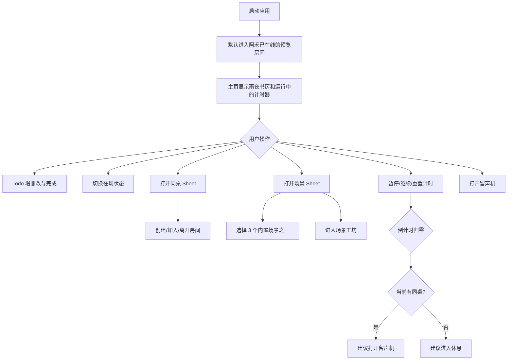
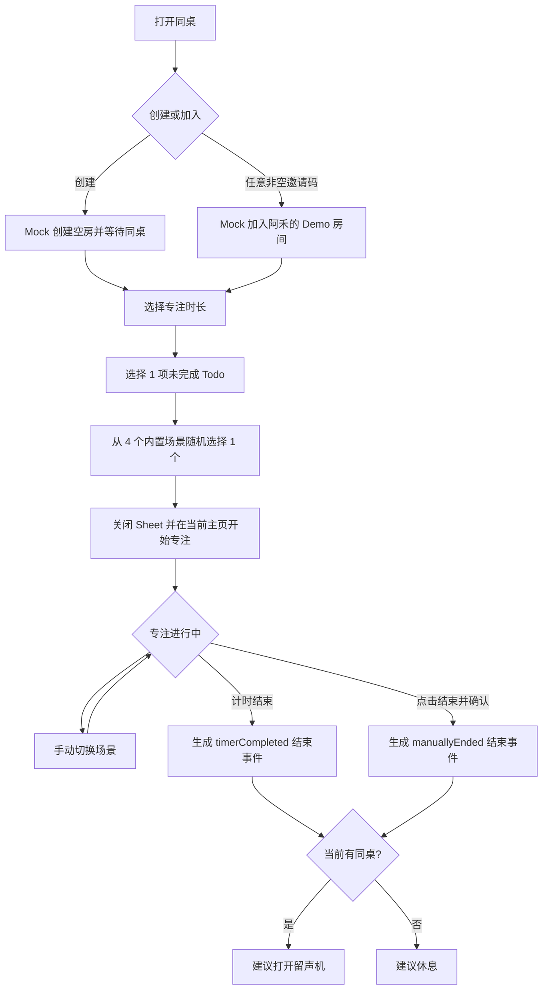
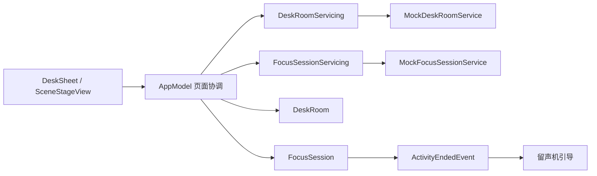

# 同桌专注流程设计

## 1. 目标与范围

本次在现有《在场》SwiftUI Demo 中补齐“同桌”产品主线：用户创建或加入本地 Mock 房间，选择专注时长和一项今日 Todo，由系统随机选择场景后在当前主页开始专注；专注过程中允许手动切换场景；计时结束或用户手动结束后，统一引导进入留声机。

本次同时完成：

- 梳理当前代码已有功能和真实页面流程。
- 修复场景元数据更新但背景图片不刷新的问题。
- 使用远端已有的 4 个基础状态场景，不增加缺少正式资源的场景条目。
- 拆出两个模块接口并提供本地 Mock 实现。

本次不做：

- 后端、HTTP API、WebSocket 或实时通信。
- 跨设备同步、房间持久化或用户账号系统。
- 自动完成 Todo、自动打开留声机或自动发送内容。
- 重构整个 `AppModel`、场景工坊、桌宠生成或留声机内部流程。

## 2. 当前代码功能清单

以下是代码中已经存在且可运行的能力，不包含产品文档里尚未完成的远期设计。

### 2.1 应用外壳与导航

- macOS、iOS 和 iPadOS 共用 SwiftUI 页面。
- macOS 使用隐藏标题栏、固定最小尺寸的单窗口布局。
- 桌面端包含左侧导航、中央场景和右侧“此刻”面板。
- 紧凑布局包含底部导航，可打开同桌、留声、此刻和场景 Sheet。
- 支持 Toast 和单条“在场建议”。

### 2.2 今日 Todo 与状态

- 默认显示 3 项 Todo。
- Todo 支持新增、改名、删除和完成状态切换。
- 最多 5 项，标题去除首尾空格，拒绝重复内容。
- 支持专注、安静、休息和离开 4 种在场状态。
- 非专注状态会暂停当前计时器，回到专注状态继续计时。

### 2.3 场景与环境

- 现有 4 个 1920x1080 内置 PNG 场景：专注、创作、行动、出走。
- 场景包含标题、文案、图片路径、环境声和天气效果元数据。
- 支持雨效开关和环境声开关。
- 场景变化会更新标题、环境声和模型路径。
- 已有场景工坊：描述场景、编辑结构化参数、生成、审查、预览和保存。
- 生成场景保存后加入场景列表并立即选中。

### 2.4 桌宠

- 支持选择好友照片、生成桌宠预览、启用、重新生成和清除。
- 图像生成、抠图配置与文本模型配置彼此独立。
- 未配置远程服务时可使用本地 Mock。
- 启用的桌宠作为独立前景图层显示在场景上。

### 2.5 同桌

- 已有创建房间、输入邀请码加入、取消加入、复制邀请码和离开房间。
- 已有固定 Demo 同桌“阿禾”和房间展示。
- 已有等待同桌建议和房间状态展示。
- 当前实现要求邀请码符合 8 位格式，并在启动时默认进入预览房间。
- 当前尚无会前时长/Todo 配置、活动级会话模型和手动结束活动。

### 2.6 计时与建议

- 支持开始、暂停、继续、重置和倒计时结束。
- 重置后固定为 25 分钟。
- 倒计时结束时生成在场建议。
- 当前只有“有同桌”时引导打开留声机；无同桌时引导休息。

### 2.7 留声机与记忆

- 留声机支持录音权限、录制、完成、播放、停止和重新录制。
- 环境声会在录音或播放期间临时静音。
- 共同记忆 Sheet 当前为静态统计和事件展示。
- 右侧面板包含一段静态最近留声入口。

### 2.8 配置与测试

- 支持从本地 YAML 读取文本、图像和抠图服务配置。
- App Sandbox 开启网络客户端能力。
- 现有 Swift Testing 覆盖 API 配置、桌宠、场景、Todo、环境声、房间、建议和场景工坊。
- 设计前基线共 35 个单元测试，全部通过。
- UI 测试目标存在，但只有默认启动样板，未覆盖产品流程。

## 3. 当前真实流程



## 4. 已确认的目标流程



## 5. 场景切换问题根因

复现路径：

1. 启动 App，主页为“雨夜书房”。
2. 打开“场景”，选择“湖畔桌面”。
3. Sheet 关闭后，标题变为“星期二 · 湖畔清晨”，环境声变为“林间鸟鸣”。
4. 实际背景仍是雨夜书房，辅助功能描述仍为“雨夜像素书房的静态背景”。

根因：`SceneStageView` 通过 `@ObservedObject` 观察 `AppModel`，但负责图片加载的 `SceneNativeRenderer` 仅以普通 `let model` 持有模型。父视图刷新后，场景标题等父级内容变化，子渲染器可能保持原有视图身份和旧图片内容。现有测试只验证 `selectedSceneID` 与图片路径的模型值，没有覆盖真实渲染结果。

修复边界：让 `SceneNativeRenderer` 自己观察 `AppModel`，并用场景 ID 明确图片视图身份；不修改场景选择按钮业务，也不绕过模型直接刷新图片。

## 6. 架构设计

采用“窄服务边界”方案。新增两个模块协议及本地 Mock，`AppModel` 继续承担现有页面协调职责，不进行全局 Store 迁移。



### 6.1 `DeskRoomServicing`

职责：创建房间和使用邀请码加入房间。

- 创建返回没有同桌的等待房间；加入才返回带“阿禾”的 Demo 房间。
- 加入码去除首尾空格后只要求非空。
- 保留异步接口形态，便于未来替换网络实现。
- 不负责专注配置、计时或页面提示。

### 6.2 `FocusSessionServicing`

职责：创建专注会话和结束事件。

- 根据房间、合法时长、未完成 Todo 和候选场景创建 `FocusSession`。
- 生产实现从候选场景中随机选择；测试实现固定返回指定场景。
- 根据活跃会话和结束原因生成唯一 `ActivityEndedEvent`。
- 不直接修改 `AppModel`、不打开 Sheet、不驱动 SwiftUI。

### 6.3 `AppModel`

职责：协调服务结果与现有页面状态。

- 持有当前房间、专注会话、最近结束事件与在场建议。
- 开始会话后更新场景、环境声、倒计时和当前 Todo 展示。
- 计时归零与手动结束汇聚到同一个结束方法。
- 防止同一会话重复结束。
- 继续管理 `activeSheet`、Toast、现有在场建议和音频生命周期。

### 6.4 页面

- `DeskSheet` 只调用 `AppModel` 的房间和会话动作，不直接依赖 Mock。
- 房间连接后，在同一 Sheet 内显示活动配置，不新建全屏页面。
- `SceneStageView` 增加活动 Todo 和“结束专注”入口。
- 结束建议复用现有 `PresenceSuggestionView` 视觉样式。

## 7. 数据契约

```swift
struct FocusSessionConfiguration: Equatable {
    let durationMinutes: Int
    let taskID: FocusTask.ID
}

struct FocusSession: Equatable, Identifiable {
    let id: UUID
    let roomID: DeskRoom.ID
    let taskID: FocusTask.ID
    let durationSeconds: Int
    let sceneID: RoomScene.ID
    let startedAt: Date
}

enum ActivityEndReason: Equatable {
    case timerCompleted
    case manuallyEnded
}

struct ActivityEndedEvent: Equatable, Identifiable {
    let id: UUID
    let sessionID: FocusSession.ID
    let reason: ActivityEndReason
    let endedAt: Date
}
```

允许的专注时长固定为 `15 / 25 / 45 / 60` 分钟，默认 25 分钟。每段专注必须选择 1 项未完成 Todo；结束后不自动将 Todo 标记为完成。

## 8. 页面与交互设计

### 8.1 房间入口

- 保留“加入房间”和“创建一个房间”。
- 加入按钮在去除首尾空格后的输入非空时可用。
- 空输入显示现有样式的行内错误。
- 创建后进入空房等待；任意非空邀请码加入后 Mock 阿禾在线。
- App 初始状态改为未连接，避免跳过完整流程。

### 8.2 活动配置

- 房间连接后显示 `15 / 25 / 45 / 60` 分段选择，默认 25。
- 展示未完成 Todo 单选列表；已完成 Todo 不作为候选。
- 未选择 Todo 时“随机场景并开始”不可用。
- 开始成功后关闭 Sheet，当前窗口保持原位。

### 8.3 专注中

- 从 4 个内置场景随机选择 1 个作为初始场景。
- 用户仍可通过现有“场景”入口手动切换。
- 手动切换只更新背景、天气和环境声，不暂停或重置计时器。
- 主页显示当前会话 Todo，并提供“结束专注”。
- 手动结束前显示二次确认。

### 8.4 活动结束

- 倒计时归零生成 `.timerCompleted`。
- 用户确认结束生成 `.manuallyEnded`。
- 两种原因都停止计时；有同桌时引导留声，无同桌时建议休息。
- 建议可执行对应操作，也可关闭。
- 不强制跳转；关闭引导不离开房间、不删除或完成 Todo。

## 9. 场景目录

使用远端已有的 4 个基础状态场景，随机开始和手动切换只使用这些具备正式资源的场景：

1. 专注 Focus
2. 创作 Make
3. 行动 Move
4. 出走 Roam

## 10. 错误与边界行为

- 空邀请码：停留入口并显示行内错误。
- 房间服务失败：保留用户输入，显示可重试错误；本地 Mock 默认不失败。
- 没有未完成 Todo：开始按钮不可用，用户可在右侧面板新增或取消已完成状态。
- 非法时长：服务拒绝创建会话，UI 只提供合法固定选项。
- 场景列表为空：服务返回明确错误；内置目录正常情况下不会为空。
- 重复结束：如果当前会话已结束，后续计时回调或重复点击无效果。
- 切换场景失败：保持当前场景和计时状态，不结束活动。

## 11. 测试与验收

### 11.1 单元测试

- `MockDeskRoomService` 创建空房，任意非空码加入时返回 Mock 同桌。
- 空邀请码被拒绝。
- 四种合法时长均可创建会话，其他时长被拒绝。
- 只允许绑定未完成 Todo。
- 测试服务可固定选择场景。
- 手动结束和计时结束产生不同 `reason`。
- 同一会话只能生成一个结束事件。
- 开始会话同步更新选中场景、倒计时和 Todo。
- 两种结束原因都生成一次结束建议，并根据是否有同桌选择留声或休息。
- 手动切换场景不会改变当前会话和剩余时间。
- `SceneNativeRenderer` 的场景 ID、图片路径和可访问性描述同步变化。

### 11.2 原生界面验证

完整路径：

```text
启动未连接状态
  -> 输入任意邀请码
  -> 进入带阿禾的 Demo 房间
  -> 选择 25 分钟和一个未完成 Todo
  -> 随机场景并开始
  -> 当前窗口显示计时与 Todo
  -> 手动切换场景且背景真实变化
  -> 手动结束并确认
  -> 显示留声机引导
  -> 打开现有留声机 Sheet
```

另使用可注入的短时会话或直接驱动计时状态验证自然结束，不等待 15 分钟。

### 11.3 完成标准

- 所有原有和新增单元测试通过。
- 4 个内置场景均能加载并手动切换。
- 场景标题、环境声、实际背景和可访问性描述一致。
- 创建进入空房等待，任意非空邀请码加入时 Mock 阿禾在线。
- 会前必须选择合法时长和一项未完成 Todo。
- 开始专注不最小化、不新开窗口。
- 计时结束和手动结束均只产生一次结束事件，并根据是否有同桌建议留声或休息。
- 用户现有的 Xcode 签名团队修改保持不变，不纳入本次功能提交。
